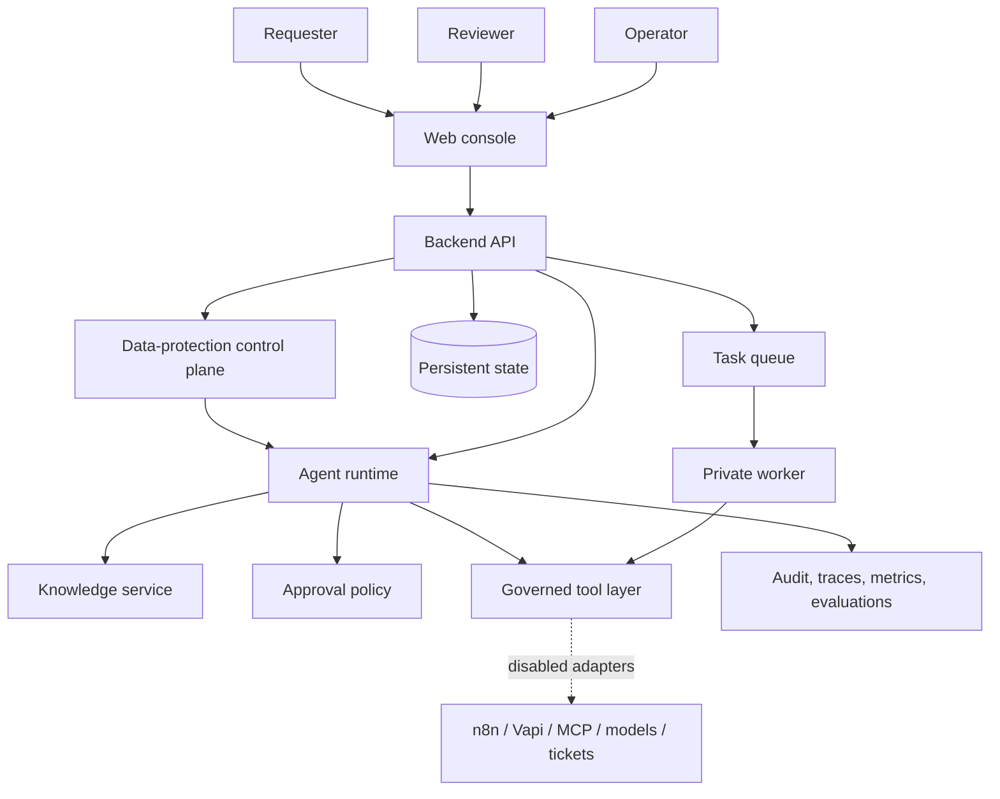
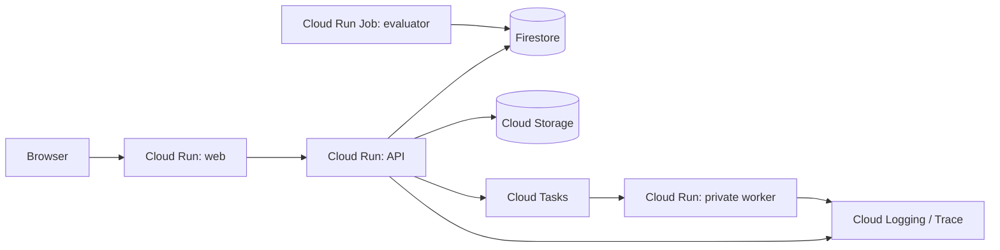

# Architecture Overview

## System context

Agentic Delivery Reference accepts a service-delivery request from an authenticated user, orchestrates a governed planning workflow, pauses before a sensitive action, and returns a result with evidence. The first implementation uses deterministic local adapters; external providers are optional extensions.

## Deployment view

## Architectural qualities

- **Scalability:** stateless containers, asynchronous long work, independently scalable deployables
- **Maintainability:** modular application core, typed contracts, provider isolation, focused shared packages
- **Traceability:** requirement identifiers, correlation IDs, state history, audit events, capability registry
- **Security:** explicit trust boundaries, backend authorization, least privilege, approval binding, safe tool policy
- **Portability:** deterministic local profile and containerized cloud profile

## Source decisions

- [ADR-0001: Modular monolith](../adr/0001-modular-monolith.md)
- [ADR-0002: Ports and simulated adapters](../adr/0002-ports-and-simulated-adapters.md)
- [ADR-0003: GCP deployment and persistence](../adr/0003-gcp-deployment-and-persistence.md)
- [ADR-0004: Agent frameworks and ML runtimes](../adr/0004-agent-frameworks-and-ml-runtimes.md)
- [ADR-0005: Phase 1 toolchain](../adr/0005-phase-one-toolchain.md)
- [ADR-0006: Local identity and state](../adr/0006-local-identity-and-state.md)
- [ADR-0007: Deterministic LangGraph runtime](../adr/0007-deterministic-langgraph-runtime.md)
- [ADR-0008: Data-protection control plane](../adr/0008-data-protection-control-plane.md)
- [ADR-0009: Human approval and local task execution](../adr/0009-human-approval-and-local-task-execution.md)
- [ADR-0010: Local RAG, guardrails, and evaluation gates](../adr/0010-local-rag-guardrails-and-evaluation-gates.md)
- [ADR-0011: Local security and operational hardening](../adr/0011-local-security-and-operational-hardening.md)
- [ADR-0012: Plan-only GCP deployment readiness](../adr/0012-gcp-plan-only-deployment-readiness.md)
