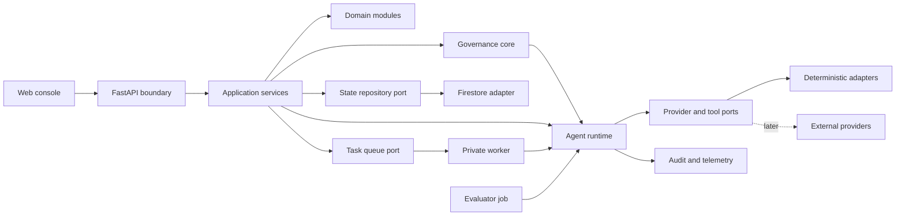

# System Design

## Architectural style

The system uses a modular monolith in one monorepo with four deployment boundaries. Application and domain modules follow ports-and-adapters dependency rules. This keeps provider SDKs and platform concerns outside core behavior while avoiding premature microservices.

## Planned deployables

| Deployable | Responsibility | Exposure |
| --- | --- | --- |
| Web console | User and administrative experience | Public HTTPS |
| API | Authentication, authorization, contracts, and use-case orchestration | Public HTTPS, application-authenticated |
| Worker | Idempotent asynchronous workflow steps and side effects | Private authenticated HTTP |
| Evaluator | Batch golden-set, baseline, and drift evaluation | On demand or scheduled job |

## Component view

## Backend modules

- **identity:** verified principal and claims adaptation
- **authorization:** role, ownership, and action policy
- **governance_core:** data classification, processing context, versioned decisions, and obligations
- **service_requests:** request lifecycle and validation
- **workflows:** state transitions, checkpoints, and recovery
- **agent_runtime:** explicit LangGraph composition
- **knowledge:** ingestion, retrieval, evidence, and citations
- **approvals:** proposal review and single-use decision consumption
- **tools:** schemas, risk classification, and governed execution
- **evaluations:** deterministic scoring, baselines, and reports
- **audit:** immutable security and business events
- **observability:** logs, metrics, traces, and correlation context
- **cost:** token and estimated provider cost accounting

## Dependency rules

1. HTTP routes depend on application use cases, never on persistence details.
2. Application code depends on domain models and ports.
3. Domain code has no web framework, cloud SDK, or model-provider dependency.
4. Infrastructure and integration adapters implement ports defined inward of them.
5. Cross-module writes occur through application use cases, not direct collection access.
6. Shared packages contain explicit contracts or cross-cutting infrastructure, not miscellaneous utilities.
7. Every material data-processing boundary evaluates governance policy before persistence or provider invocation.

## Data ownership

| Data | Owner | Initial persistence |
| --- | --- | --- |
| Service request | service_requests | Firestore/emulator |
| Workflow and checkpoints | workflows | Firestore/emulator through repository port |
| Session messages | agent_runtime memory | Firestore/emulator with retention metadata |
| Approval proposal/decision | approvals | Firestore/emulator, transactional consumption |
| Tool execution record | tools | Firestore/emulator |
| Knowledge document metadata | knowledge | Firestore/emulator |
| Knowledge content/artifacts | knowledge | Cloud Storage/local fixture adapter |
| Audit events | audit | Append-only Firestore collection; later export |
| Evaluation report | evaluations | Versioned file locally; Cloud Storage later |

## Consistency and delivery semantics

- Asynchronous processing is at least once.
- Side effects require an idempotency key scoped to operation and workflow.
- Workflow records carry a monotonically increasing `state_version`.
- Approval decisions are consumed atomically and at most once.
- Checkpoints precede any interrupt and follow successful side effects.
- External actions never occur inside an uncommitted state transaction.
- A transactional outbox may be added if task dispatch and state persistence cannot be made recoverable through reconciliation.

## API conventions

- Base path: `/v1`
- JSON request and response bodies
- ISO 8601 UTC timestamps
- Opaque string identifiers
- `Idempotency-Key` required for mutable retryable operations where specified
- `X-Correlation-ID` accepted and validated or generated server-side
- RFC 7807-compatible problem details for errors
- Cursor-based pagination for append-only histories
- Every response returns a validated or generated correlation identifier and defensive headers
- `/health` is liveness; `/ready` is dependency readiness
- Operational views expose only allowlisted metadata under backend RBAC

The initial contract is stored at `packages/contracts/openapi/agentic-delivery-api.json`.

## Integration readiness

External capabilities are represented by ports with deterministic simulated implementations. A future real adapter must pass the same contract suite and add explicit authentication, timeouts, bounded retries, error mapping, audit hooks, and configuration validation.

In the local Phase 4 profile, the task queue and ticket executor are in-memory adapters owned by the API process. An authenticated operator explicitly processes queued tasks through the local operations endpoint. This preserves the proposal, approval, queue, governance, and idempotency boundaries without claiming a durable background service; Cloud Tasks, n8n, or another adapter can later replace only those ports.

The Phase 6 local operations adapter records request route templates, status, duration, correlation, and timestamp only. Audit records are structured and attributable but remain process-local. No payload, prompt, authorization header, idempotency key, or response body crosses into operational telemetry.

## Environment profiles

| Profile | Purpose | External dependencies |
| --- | --- | --- |
| local | Development and demonstration | None paid; simulators and emulators |
| development | First GCP verification | GCP managed services; synthetic data |
| staging | Release candidate and UAT | Isolated GCP project |
| production | Future authorized deployment | Explicitly out of initial scope |

## Key trade-offs

- A modular monolith reduces operational overhead but requires enforced module boundaries.
- Firestore aligns with the target platform but a custom LangGraph checkpointer adapter requires careful concurrency tests.
- A deterministic local retriever is reproducible but less semantically capable than a real embedding pipeline.
- Public web/API endpoints simplify the reference deployment; the API must therefore enforce identity, authorization, rate limits, and input controls rigorously.
