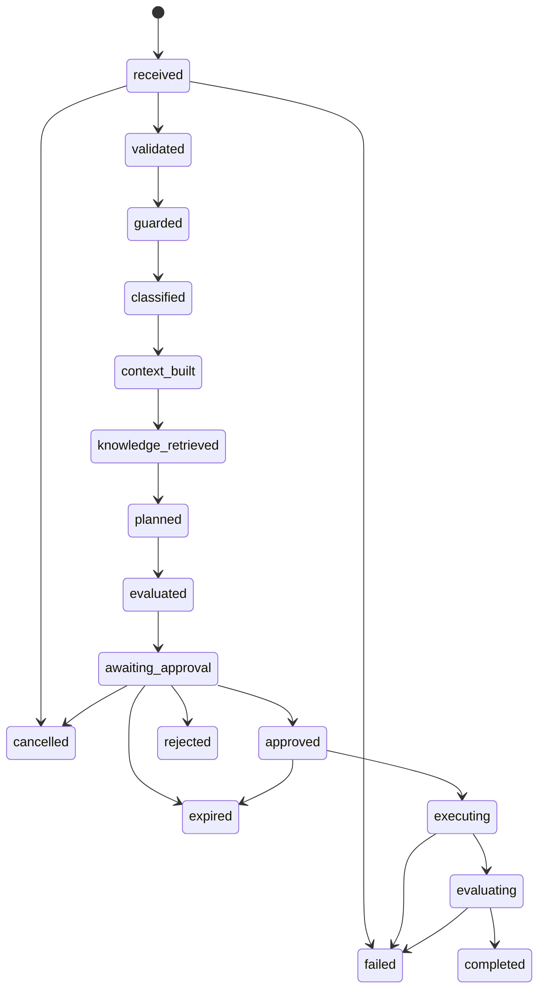

# Workflow State Model

## States

| State | Meaning | Terminal |
| --- | --- | --- |
| `received` | Request stored but not validated | No |
| `validated` | Request is normalized and accepted | No |
| `guarded` | Input passed the runtime safety boundary | No |
| `classified` | Request category and complexity policy selected | No |
| `context_built` | Execution context assembled | No |
| `knowledge_retrieved` | Knowledge and citations recorded | No |
| `planned` | Structured proposal created | No |
| `evaluated` | Grounding, integrity, structure, and safety gate passed | No |
| `awaiting_approval` | Sensitive tool proposal is paused | No |
| `approved` | Proposal authorized for one execution | No |
| `rejected` | Reviewer rejected the action | Yes |
| `expired` | Proposal or approval expired before execution | Yes |
| `executing` | Worker is processing the authorized action | No |
| `evaluating` | Result is being scored | No |
| `completed` | Workflow completed successfully | Yes |
| `failed` | Permanent or exhausted failure | Yes |
| `cancelled` | Authorized user cancelled before side effect | Yes |

## Valid transitions

## Invariants

1. A workflow has exactly one owner and one immutable `workflow_id`.
2. Every transition increments `state_version` and appends an audit event.
3. A transition requires the expected previous state and state version.
4. Only an authorized reviewer can transition `awaiting_approval` to `approved` or `rejected`.
5. The reviewer cannot approve their own request in the default policy.
6. Approval has an expiry, permitted action, schema hash, and immutable proposal digest.
7. An edited proposal is revalidated and receives a new digest before approval.
8. `executing` requires an unexpired, unconsumed approval matching the proposal digest.
9. A side effect record with the same idempotency key returns its original result.
10. Terminal states cannot transition without an explicit future recovery design.
11. Untrusted model output cannot perform a state transition directly.

## Failure classification

| Class | Behavior |
| --- | --- |
| Validation | Reject before execution; no retry |
| Authentication/authorization | Deny and audit; no retry |
| Transient infrastructure | Bounded retry with backoff |
| Provider rate limit | Retry only when policy and deadline permit |
| Permanent provider failure | Safe failure with mapped reason |
| Policy violation | Block action and record security event |
| Internal defect | Fail safely, preserve correlation ID, expose no internals |

## Checkpoint boundaries

Checkpoints are written after each successful state-changing node and before a human interrupt. Side-effecting nodes must be idempotent because LangGraph may resume or re-execute work after failure. The persistent repository remains the source of truth; in-memory checkpointing is limited to tests.
