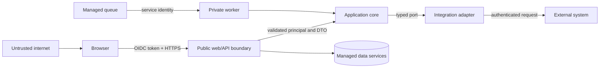

# Threat Model

## Scope

The model covers the browser, public web and API boundaries, agent runtime, retrieval content, human approval, worker, persistence, telemetry, and future external adapters. It assumes internet-originated requests and potentially malicious content in both user input and knowledge documents.

## Assets

- User identity and authorization claims
- Service requests and generated proposals
- Workflow state and checkpoints
- Approval proposals and decisions
- Tool credentials and external-service secrets
- Knowledge documents and citations
- Audit events, traces, and evaluation reports
- Cloud identities, infrastructure configuration, and cost budget

## Actors

- Legitimate requester, reviewer, operator, administrator, and engineer
- Authenticated user attempting privilege escalation
- Anonymous internet attacker
- Malicious or compromised external provider
- Attacker controlling a retrieved document or user prompt
- Accidental operator or configuration error
- Compromised dependency or build input

## Entry points

- Web forms and browser routes
- Public API endpoints and headers
- Authentication tokens
- Uploaded or repository knowledge documents
- Approval endpoints
- Private worker endpoint and queued payloads
- Future webhooks, MCP, n8n, Vapi, model, and ticketing adapters
- CI workflows, container images, and infrastructure inputs

## Trust boundaries

Untrusted content remains untrusted after retrieval or model processing. A model response never crosses directly into an authorized side effect.

## Principal threats and mitigations

| ID | Threat | Impact | Primary mitigations | Residual risk |
| --- | --- | --- | --- | --- |
| TM-001 | Token theft or forged identity | Unauthorized access | HTTPS, SDK token verification, short-lived tokens, revocation policy, no token logging | Compromised user device |
| TM-002 | Broken object-level authorization | Cross-user data disclosure | Server-side ownership checks, deny-by-default policy, indistinguishable not-found response | Policy implementation defect |
| TM-003 | Role escalation or self-approval | Unauthorized side effect | Trusted claims, backend RBAC, separation of duties, reviewer/requester check | Misconfigured administrator |
| TM-004 | Prompt injection | Tool misuse or data leakage | Instruction/content separation, tool allowlist, schema validation, deterministic policy, human approval | Novel social-engineering content |
| TM-005 | Malicious retrieved document | Poisoned output or hidden instructions | Source allowlist, content provenance, injection scanning, citations, no tool authority from content | Plausible but false content |
| TM-006 | Approval replay or race | Duplicate/altered action | Expiry, one-time transactional consumption, proposal digest, expected state version | Datastore outage during decision |
| TM-007 | Duplicate queued work | Duplicate side effect | Idempotency key, execution record, reconciliation | External system lacking idempotency |
| TM-008 | SSRF through tool arguments | Internal network or metadata access | No arbitrary URL tool, allowlisted destinations, egress controls, URL normalization | Misconfigured allowlist |
| TM-009 | Sensitive data in telemetry | Information disclosure | Field allowlist, redaction, payload minimization, tests, restricted log access | Novel sensitive field |
| TM-010 | Secret committed or exposed | Provider/cloud compromise | Secret scanning, `.env` exclusion, Secret Manager, least privilege, rotation | Secret copied outside workflow |
| TM-011 | Dependency or image compromise | Code execution/supply-chain attack | Lock files, provenance, scanning, minimal images, reviewed updates | Upstream zero-day |
| TM-012 | Resource exhaustion/cost abuse | Availability and financial loss | Input limits, rate limits, queue bounds, model budget, max instances, timeouts | Distributed authenticated abuse |
| TM-013 | Audit tampering | Loss of accountability | Append-only interface, restricted writer identity, export/retention, correlation | Privileged project compromise |
| TM-014 | Unsafe error disclosure | Information disclosure | Problem-details mapping, correlation ID, internal-only diagnostics | Unreviewed adapter error |
| TM-015 | Forged local task processing | Approval bypass or unauthorized side effect | Operator RBAC, typed task contract, proposal digest check, execution-time governance decision | Local identity fixtures are not production service IAM |
| TM-016 | Evaluation-gate bypass | Ungrounded or unsafe proposal reaches approval | Gate runs inside runtime before result return; application creates tool proposal only from passing result; negative tests | Defect in deterministic checks |
| TM-017 | Knowledge provenance or hash tampering | Poisoned context presented as trusted evidence | Versioned corpus, document allowlist, SHA-256 content hash, integrity gate, quarantined content | Authorized repository contributor can alter corpus and baseline together |
| TM-018 | Observability endpoint disclosure | Prompts, credentials, identity, or system topology exposed | Allowlisted schemas, backend RBAC, no payload capture, sanitizer, no-store responses | Privileged administrator can access legitimate audit metadata |
| TM-019 | Correlation spoofing or log injection | Misleading evidence or parser abuse | Restricted correlation syntax, generated fallback, structured fields, length limits | Authorized callers can choose valid opaque identifiers |
| TM-020 | Local request flooding | Resource exhaustion and degraded availability | Per-principal fixed-window limit, input bounds, safe 429, cloud edge controls planned | In-memory limits are per replica and reset on restart |
| TM-021 | CI identity spoofing or credential theft | Unauthorized infrastructure mutation | GitHub OIDC, repository-bound attribute condition, short-lived credentials, no service-account keys, protected environments | Compromised authorized repository or reviewer |
| TM-022 | Accidental Terraform apply or wrong-environment target | Unexpected cost, exposure, or destructive change | Empty graph by default, dual activation variables, environment validation, remote state prefixes, exact confirmation, manual-only CD | Authorized operator can deliberately override controls |
| TM-023 | Over-privileged or shared runtime identity | Cross-service privilege escalation | Distinct service accounts, resource-scoped roles, private worker, OIDC task invocation, IAM review gate | Provider roles may still contain unused permissions |
| TM-024 | Terraform state or plan disclosure | Resource metadata or secret exposure | Remote encrypted state, versioning, access-controlled bucket, ignored local state and plan files, no secret values in Terraform | State administrators retain legitimate visibility |

## Security invariants

1. Authentication data is not authorization by itself.
2. The model cannot grant permissions, approve actions, or select arbitrary network destinations.
3. A tool receives only the arguments required for its operation.
4. Approval binds to the exact action and proposal digest.
5. Service accounts are unique per deployable and cannot impersonate a user.
6. External errors are normalized before they cross into public responses.
7. No secret or production data is required for local development.
8. A proposal cannot become an approvable action unless its grounding and safety gate passes.
9. Cloud resource creation is disabled by default and cannot be inferred from plan-only evidence.
10. CI/CD uses short-lived federated identity and never accepts a service-account key.

## Security verification

- Unit tests for policies and transition invariants
- Integration tests for claims, ownership, and datastore transactions
- Adversarial golden-set cases for injection and unsafe tool requests
- Secret, dependency, infrastructure, and container scanning
- Log-redaction assertions against representative failures
- Staging review of IAM bindings, ingress, egress, and service identities

## Blocking findings

Any finding permitting unauthorized access, sensitive-data exposure, approval bypass, privilege escalation, destructive tool execution, or secret compromise blocks release.

## Deferred decisions

- Exact retention periods require product and regulatory context.
- External webhook signature schemes depend on the selected provider.
- Regional placement and data residency require deployment context.
- Customer-managed encryption keys are not required for the reference MVP unless a deployment policy demands them.
